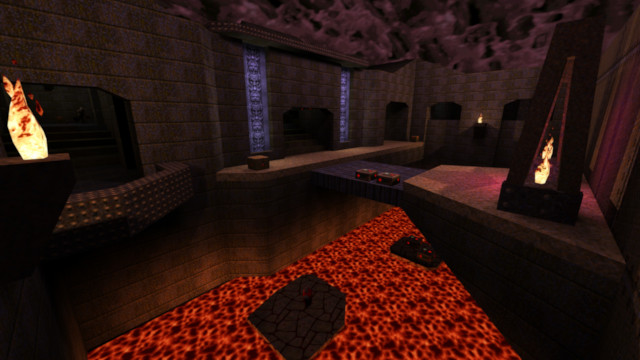

# rtlights4quake
A collection of rtlights and cubemaps for Quake engines that support real-time lighting files such as [Darkplaces](https://icculus.org/twilight/darkplaces/) and [FTE Quake](http://fte.triptohell.info/).

[](docs/assets/e3m6.jpg)

## Installation

Each [release](https://github.com/hemebond/quake-rtlights/releases) has a pre-compiled pk3 file that can be placed directly into the `id1` directory.

Alternatively you can place the `.rtlights` files into the `id1/maps/` directory, and the cubemaps into the `id1/cubemaps/` directory.

## Re-VIS
Re-vis-ing the original maps means recompiling parts of the original maps so that transparent water works correctly and is done using a tool such as [vispatch](http://vispatch.sourceforge.net/).

## Settings
Once you have your maps properly VIS'd, launch DarkPlaces and turn on real-time lighting, either via the menus:

- Options
  - Customize Lighting
    - RT DLights: On
    - RT DLight Shadows: On
    - RT World: On
  - Customize Effects
    - Water Alpha (opacity): 0.7

Or via the console (`~`):

```
r_shadow_realtime_dlight 1
r_shadow_realtime_dlight_shadows 1
r_shadow_realtime_world 1
r_wateralpha 0.7
```
