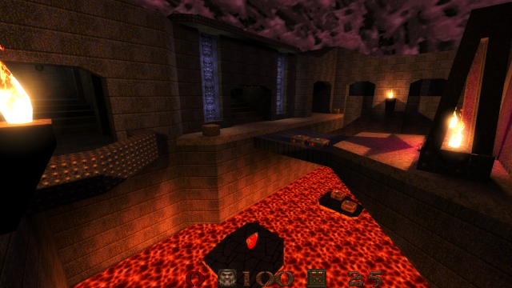

# RTLights for Quake
A collection of rtlight and cubemap files for Quake engines that support real-time lighting such as [Darkplaces](https://icculus.org/twilight/darkplaces/) and [FTE Quake](http://fte.triptohell.info/).

<p align="center">
    <a href="https://raw.githubusercontent.com/hemebond/quake-rtlights/master/.github/e3m6.jpg"></a>
</p>

## Installation

Each [release](https://github.com/hemebond/quake-rtlights/releases) has a pre-compiled pk3 file that can be placed directly into the `id1` directory.

Alternatively you can place individual `.rtlights` files into the appropriate `mod/maps` directory, and cubemaps into the `mod/cubemaps/` directory.

## Usage ##

### Re-VIS
Re-VIS-ing the original maps means recompiling parts of the original maps so that transparent water works correctly and is done using a tool such as [vispatch](http://vispatch.sourceforge.net/).

### Settings
Once you have your maps properly VIS'd, launch DarkPlaces and turn on real-time lighting, either via the menus:

- Options
  - Customize Lighting
    - RT DLights: On
    - RT DLight Shadows: On
    - RT World: On
  - Customize Effects
    - Water Alpha (opacity): 0.7

or via the console (`~`):

```
r_shadow_realtime_dlight 1
r_shadow_realtime_dlight_shadows 1
r_shadow_realtime_world 1
r_wateralpha 0.7
```

### Arcane Dimensions ###

Because the map sources are available for [Arcane Dimensions](http://www.simonoc.com/pages/design/sp/ad.htm) maps, some have been re-lit with a combination of light-maps (.lit file) and real-time lighting (.rtlights file). For these maps, both the *real-time world shadows* and *world light-maps* should be enabled via the menu:

- Options
  - Customize Lighting
    - RT World: On
    - RT World Lightmaps: 1

or via the console (`~`)

```
r_shadow_realtime_world_lightmaps 1
r_shadow_realtime_world_shadows 1
```

